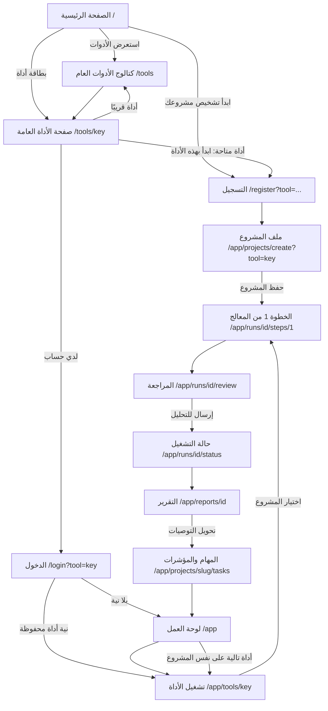

# رحلة العميل — من الزيارة الأولى إلى تقرير قابل للتنفيذ

> المرجع الواحد لمسار المستخدم عبر الموقع العام ولوحة العمل.
> أي صفحة جديدة يجب أن تُعرَّف داخل هذه الرحلة: من أين يصل إليها المستخدم، وإلى أين تدفعه.

## 1. المبدأ الحاكم

كل صفحة تجيب عن ثلاثة أسئلة، وإلا فهي طريق مسدود:

1. **أين أنا؟** (سياق واضح: أنت في أداة كذا، الخطوة 2 من 4)
2. **ما الخطوة التالية؟** (فعل واحد أساسي، لا أربعة أفعال متساوية)
3. **ماذا يحدث لو تركتها الآن؟** (حفظ تلقائي، ويمكنك العودة)

قاعدة ثانية: **لا نعد بما لم يُبنَ**. الأداة غير المفعّلة تُعرض بحالة «قريبًا» صريحة، ولا يوجد زر يقود إلى فراغ.

## 2. الخريطة

## 3. المحطات، محطة بمحطة

| # | المحطة | المسار | سؤال المستخدم | الفعل الأساسي | الوجهة التالية |
|---|--------|--------|---------------|----------------|-----------------|
| 1 | الرئيسية | `/` (`home`) | هل يفهم هذا الموقع مشكلتي؟ | «ابدأ تشخيص مشروعك» | التسجيل بنية أداة الدخول |
| 2 | كتالوج الأدوات | `/tools` (`tools.index`) | ما الذي سأحصل عليه فعلًا؟ | فتح أداة | صفحة الأداة |
| 3 | صفحة الأداة | `/tools/{key}` (`tools.show`) | ما الأسئلة والمخرجات؟ | «ابدأ بهذه الأداة» | التسجيل حاملًا `?tool=` |
| 4 | التسجيل | `/register` | كم سيكلفني هذا من وقت؟ | إنشاء الحساب | نموذج المشروع بنفس الأداة |
| 5 | الدخول | `/login` | أين توقفت؟ | دخول | الأداة المقصودة أو اللوحة |
| 6 | ملف المشروع | `/app/projects/create` | لماذا تسألني هذا؟ | حفظ المشروع | **الخطوة 1 من الأداة مباشرة** |
| 7 | معالج الأداة | `/app/runs/{run}/steps/{n}` | كم بقي؟ | الإجابة خطوة بخطوة | المراجعة |
| 8 | المراجعة | `/app/runs/{run}/review` | هل إجاباتي مكتملة؟ | إرسال للتحليل | حالة التشغيل |
| 9 | حالة التشغيل | `/app/runs/{run}/status` | هل انتهى؟ | متابعة التقدم | التقرير |
| 10 | التقرير | `/app/reports/{report}` | ماذا أفعل الآن؟ | تحويل التوصيات إلى مهام | المهام |
| 11 | المهام والمؤشرات | `/app/projects/{project}/tasks` | من ينفذ وكيف نقيس؟ | تحديث الحالة | اللوحة |
| 12 | لوحة العمل | `/app` | ما وضع مشاريعي؟ | تشغيل أداة تالية | معالج جديد |

## 4. قاعدة الاستمرارية: «نية البدء»

المشكلة التي حُلّت: زائر يختار أداة، يسجّل، فيهبط على لوحة فارغة ويُطلب منه أن يبدأ من الصفر.

الآلية (`App\Http\Controllers\Concerns\CarriesStartIntent`):

1. رابط الأداة العامة يحمل `?tool={key}` إلى التسجيل أو الدخول.
2. المفتاح يُتحقق منه مقابل الأدوات **القابلة للتشغيل** فقط، ثم يُحفظ في الجلسة.
3. بعد التسجيل: تحويل إلى `app.projects.create?tool={key}` مع بيان صريح بالخطوة التالية.
4. بعد حفظ المشروع: تشغيل الأداة تلقائيًا والانتقال إلى الخطوة 1.
5. النية تُستهلك مرة واحدة، ومفتاح غير معروف أو أداة «قريبًا» يُتجاهل بصمت بدل كسر المسار.

## 5. نقاط الدخول غير الرئيسية

| المصدر | أين يهبط | ما الذي يجب أن يراه |
|--------|----------|---------------------|
| رابط لينكدإن/محتوى | `/` ثم `#knowledge` | مسار واضح من المحتوى إلى الأدوات |
| بحث عن أداة بعينها | `/tools/{key}` | صفحة مستقلة كاملة: أسئلة + مخرجات + بدء |
| مستخدم عائد | `/login` | استئناف، لا إعادة تعريف |
| مستخدم داخل الجلسة | رأس الصفحة يظهر «لوحة العمل» بدل «ابدأ الآن» | لا يُطلب منه التسجيل مرتين |

## 6. ما لم يُبنَ بعد (سجل الفجوات)

| # | الفجوة | الأثر | القرار المقترح |
|---|--------|-------|-----------------|
| 1 | وضع الضيف (تشخيص بلا حساب) | النموذج `GuestSession` موجود بمنطق مطالبة، بلا مسارات أو واجهة | مرحلة تالية: تشغيل ضيف محدود بأداة واحدة + مطالبة بالنتيجة عند التسجيل. حتى ذلك الحين، حُذف الوعد من الصفحة الرئيسية والأسئلة الشائعة |
| 2 | استعادة كلمة المرور | مستخدم عائد نسي كلمته يخرج نهائيًا | إضافة مسار reset كامل |
| 3 | التحقق من البريد | لا تمييز بين بريد صحيح ووهمي | `MustVerifyEmail` مع لافتة غير حاجزة |
| 4 | صفحات قانونية | روابط «الخصوصية» و«الشروط» تشير إلى الأسئلة الشائعة | صفحتان مستقلتان `/privacy` و`/terms` |
| 5 | صفحة 404 مخصصة | خروج من الرحلة عند أي رابط خاطئ | 404 يعرض الأدوات ومسار العودة |
| 6 | مقارنة تشغيلين للأداة نفسها | وعد «قابلة للمقارنة لاحقًا» غير مكتمل في الواجهة | عرض فرق الدرجة بين تقريرين |
| 7 | الأدوات السبع «قريبًا» | 7 من 11 غير مشغّلة | ترتيب أولوياتها ببيانات الاستخدام بعد الإطلاق |

## 7. اختبار الحراسة

`tests/Feature/PublicToolJourneyTest.php` يحرس الحلقات لا الشكل:

- الرئيسية تشير إلى الكتالوج وإلى نقطة بدء حقيقية.
- الكتالوج وصفحة الأداة يعملان بلا حساب.
- التسجيل من أداة ينتهي بالخطوة الأولى من تلك الأداة.
- الدخول من أداة يعود إليها.
- مفتاح أداة غير مفعّلة لا يكسر المسار.

أي تعديل يقطع حلقة من الرحلة يسقط هنا قبل أن يصل إلى الإنتاج.

## 8. لغة الواجهة (قاعدة ملزمة)

كل نص يراه العميل — في الموقع والتطبيق ولوحة العمل — يخضع لأربع قواعد:

1. **ابدأ من وجعه لا من قدراتنا.** بطاقة كل حالة تفتح بجملة يقولها هو عن نفسه، ثم ما سيخرج به.
2. **لا مصطلحات بلا شرح.** أي كلمة قد لا يعرفها العميل تُشرح في السطر نفسه أو تُستبدل بكلمة يعرفها.
3. **لكل سؤال سبب معلن.** كل حقل يحمل `why` يُعرض للعميل: لماذا نسأل، وكيف تغيّر الإجابة النتيجة.
4. **لا حديث عن آلة المنصة.** لا عدد أدوات، ولا «جاهزة/غير جاهزة» بالأرقام، ولا مفردات داخلية مثل «تشغيل» و«منظومة» و«مخرجات».

اللهجة: عربية بسيطة قريبة من المحكية، بلا مفردات محلية صرفة تمنع فهم قارئ من بلد آخر.

## 9. قاعدة «مرة واحدة فقط»

`App\Services\Tools\ProjectAnswerMemory` تحكم الاتجاهين:

- ما يكتبه المستخدم في أي خطوة يُحفظ في `project_answers` وفي ملف المشروع (`project_profiles`) معًا.
- أي خطوة جديدة تُملأ مسبقًا من ذاكرة المشروع، وتُعرض إجاباتها المعروفة مطوية في صندوق واحد.
- تعديل ملف المشروع يحدّث الذاكرة، فتعرفه الخطوات التالية فورًا.
- `php artisan projects:backfill-answers` يسترجع ما كُتب قبل تفعيل الذاكرة.

يحرسها `tests/Feature/ProjectAnswerMemoryTest.php`.

## 10. أرقام السوق داخل الأسئلة

ثلاث طبقات خلف الواجهة نفسها (`App\Contracts\BenchmarkProvider`)، والشاشة لا تعرف أيها ردّ:

| الطبقة | الصنف | ماذا تعطي |
|--------|-------|-----------|
| حيّة | `LiveMarketBenchmarks` | تكلفة النقرة الحقيقية في مجال المستخدم وبلده، ومنها تقدير معلن لتكلفة الوصول لعميل |
| إرشادية | `MarketBenchmarks` | مدى شائع حسب نموذج العمل، يعمل دائمًا وبلا تكلفة |
| لا شيء | — | الحقول التي لا رقم لها لا تعرض شيئًا بدل اختلاق رقم |

قواعد ملزمة:

1. **لا نداء خارجي داخل الطلب.** `benchmarks:refresh` أمر مجدول يجلب ويخزن في `benchmark_snapshots`
   للتوليفات المستخدمة فعلًا (مجال × بلد × نموذج عمل)، والشاشة تقرأ اللقطة.
2. **سقوط صامت.** غياب المفتاح أو تعطل المزوّد يعيدنا إلى الجدول الإرشادي، ويُسجَّل في اللوق ولا يُعرض خطأ.
3. **مقيس أو مشتق، ولا خلط.** الرقم المقيس يُعرض باسم مصدره وتاريخ قياسه، والمشتق يُعلن أنه تقدير
   مع طريقة اشتقاقه (`click_to_customer_rate` في `config/benchmarks.php`).
4. **ما لا يُجلب لا نُوهم بأنه يُجلب.** تكلفة اكتساب العميل لمنافس بعينه رقم داخلي لا يُنشر،
   ولا نعرضه ولا ندّعي معرفته.

التفعيل: `BENCHMARKS_LIVE_ENABLED=true` + مفاتيح المزوّد في `.env`، ثم `php artisan benchmarks:refresh`.

## 11. أرضية النتائج: لا تقرير فارغ

المحطة الأخيرة (النتيجة والمهام) كانت تنكسر أكثر مما تنجح: مرحلة `synthesis`
تفشل في مطابقة المخطط فيصل العميل إلى تحليل بلا توصية واحدة. القاعدة الآن:

**لا يصل تقرير بلا خطوة قابلة للتنفيذ، مهما فعل الذكاء الاصطناعي.**

طبقتان تحرسان هذا:

1. **إنقاذ المخرج الجزئي** (`StructuredRunner` مع `salvage`): إن كانت نتيجة واحدة
   من خمس معطوبة، نُبقي الأربع السليمة بدل إسقاط الكل. مفعّل على الخلاصة.
2. **أرضية حتمية** (`DeterministicInsights`): حين تبقى النتائج فارغة، تُشتق
   النتائج والتوصيات من درجة العميل نفسها — البند الأعلى وزنًا والأدنى عائدًا
   يتصدّر، ونصّه من `weak_advice` بلغة العميل. حتمية لا افتراضية: من إجاباته لا من تخمين.

`ReportComposer` يستدعي الأرضية إذا خلا التقرير من توصيات، ويشتق «الخطوة التالية»
من أعلى توصية أثرًا. يتوافق مع اتجاه سيادة البيانات: المحرك الأساسي محلي حتمي،
والذكاء الخارجي يحسّن الصياغة لا يصنع النتيجة.

حراسة: `DeterministicInsightsTest`، `StructuredRunnerSalvageTest`،
و`ToolRunPipelineTest::a_provider_failure_still_delivers_actionable_priorities_from_the_score`.

## 12. تحديد المنافسين (تقسيم عمل حسب الطبقة)

الفخّ: البحث الآلي أقوى ما يكون حيث لا يهم (إقليمي/عالمي) وأضعف حيث يهم أكثر
(محلي)، لأن المنافس المحلي الصغير على واتساب/إنستغرام بلا بصمة رقمية تُفهرَس.
لذلك لا «نطلب فقط» ولا «نبحث فقط»، بل مزيج بتقسيم عمل:

| الطبقة | من يحدّد | الحالة في `project_competitors` |
|--------|----------|-------------------------------|
| محلي (يقود) | المستخدم يسمّيه — يقين | `source=named, tier=local, status=confirmed` |
| إقليمي/عالمي | نقترح مرشّحًا، هو يؤكد | `source=suggested, status=candidate` |

القاعدة: **المرشّح ليس منافسًا حتى يؤكده المستخدم** — نفس انضباط الأرقام
(مقيس/مشتق/لا يُجلب).

التدفق (`App\Services\Competitors\CompetitorRegistry`):
1. أي أداة تكتب في حقل `competitor_names` → `ReportComposer` يلتقطها →
   `rememberNamed` يفكّك النص الحر (أسطر/فواصل/«و») ويحوّل `@handle` إلى رابط
   إنستغرام، ويخزّنهم محليين مؤكدين على مستوى المشروع.
2. يظهرون في تقارير كل الأدوات بلا إعادة إدخال (نفس قاعدة «مرة واحدة»).
3. قسم «راقب منافسيك» يعرضهم محلي-أولًا + مكتبات إعلاناتهم + ماذا تبحث عنه،
   ويدعو لتحديد محليين إن لم يُسمِّهم بعد.
4. مراقبتهم تصير نتيجة قابلة للتحويل إلى مهمة.

اكتشاف المرشّحين الإقليميين: مصدره «من يزايد على كلماتك» من
`LiveMarketBenchmarks` (يحتاج مفتاح API؛ الطبقة والواجهة جاهزتان، والتفعيل مؤجَّل).
حراسة: `CompetitorRegistryTest`، `CompetitorReportSectionTest`.

## 13. حلقة المنافسين المكتملة (نقترح ← يؤكد ← يُغذّي)

الطبقات الثلاث فوق القسم 12 صارت مكتملة:

1. **واجهة التأكيد/الاستبعاد** — من داخل التقرير: زر «✓ ينافسني» يرقّي المرشّح،
   «×» يستبعده، ونموذج «أضِفهم» يسمّي محليين. القائمة تُقرأ حيّة في `ReportPresenter`
   (لا لقطة)، فالتغيير يظهر فورًا. المسارات محمية بملكية المشروع (404 للغريب).
   `App\Http\Controllers\App\CompetitorController` + `CompetitorManagementTest`.

2. **الاكتشاف الإقليمي الحيّ** — `CompetitorProvider` (عقد) + `LiveCompetitorProvider`
   (نتائج بحث SERP لفئة المشروع، يستبعد المنصات العامة ونطاق المستخدم) +
   `CompetitorDiscovery` (منسّق) + أمر مجدول `competitors:discover` أسبوعيًا.
   ما يُكتشف مرشّحات لا حقائق، ولا شيء يُخترع بلا مصدر. مغلق خلف مفتاح benchmark.
   `CompetitorDiscoveryTest`.

3. **تغذية تحليل الذكاء الاصطناعي** — `ToolRunPipeline` يلتقط المنافسين المسمّين
   بعد الدرجة (قبل الخلاصة)، ويمرّرهم بالاسم في سياق `synthesis` فيقارن التحليل
   العميل بمنافسيه لا بمنافسة مجرّدة. بلا منافسين مسمّين: القائمة فارغة، لا اختلاق.
   `CompetitorAiContextTest`.

الحلقة الكاملة: المستخدم يسمّي محليًا (يقين) → نكتشف إقليميًا (مرشّح) → هو يؤكد →
الكل يغذّي التحليل والتقرير والمهام. المحلي يقود في كل خطوة.
